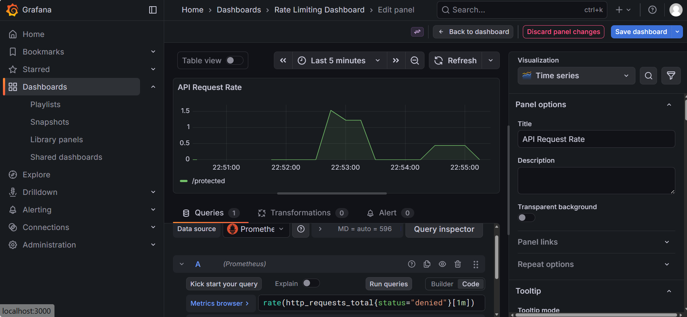

# Distributed Rate Limiter

This project demonstrates a production-ready, distributed rate limiting system built with Go, Redis, and Docker. It's designed for scalability and observability, making it suitable for protecting APIs in a microservices architecture.

The system implements a tiered rate-limiting strategy, applying different limits based on user authentication levels (e.g., anonymous, free, premium). It uses Redis as a centralized, high-performance store to track request quotas across multiple API server instances, ensuring consistency even behind a load balancer.

The entire stack is containerized with Docker and orchestrated with Docker Compose, allowing for easy setup and deployment. Observability is a key feature, with Prometheus collecting metrics on allowed and denied requests, and a pre-configured Grafana dashboard for real-time visualization.

## Features

- **Distributed & Scalable**: Uses Redis as a central store, allowing multiple API instances to share rate-limiting state.
- **Tiered Rate Limiting**: Applies different limits for `anonymous`, `free`, and `premium` users based on an API key.
- **Atomic Operations**: Leverages Redis Lua scripting (via the `go-redis-rate` library) to prevent race conditions when decrementing quotas.
- **Full Observability**:
  - **Prometheus**: Exposes custom metrics (`http_requests_total`) with `status` (allowed/denied) and `path` labels.
  - **Grafana**: Includes a pre-built dashboard to visualize API request rates for both allowed and denied traffic.
- **Containerized**: Fully containerized with Docker and Docker Compose for easy, one-command setup.

## Tech Stack

- **Application**: Go (Golang) with the Gin web framework.
- **Centralized Store**: Redis (for atomic rate-limiting counts).
- **Monitoring**:
  - **Prometheus**: For time-series data collection.
  - **Grafana**: For data visualization and dashboards.
- **Containerization**: Docker & Docker Compose.

## System Architecture

1.  A user sends a request to the API, including an `X-API-Key` header.
2.  The Go API server receives the request.
3.  A middleware intercepts the request and queries Redis to check if the user associated with the API key has enough quota remaining.
4.  Redis atomically checks and decrements the user's request count.
5.  - **If quota is available**: The request is processed, and the `http_requests_total{status="allowed"}` metric is incremented.
    - **If quota is exceeded**: The server immediately returns an `HTTP 429 Too Many Requests` error, and the `http_requests_total{status="denied"}` metric is incremented.

This process is consistent across any number of API server instances.

## Getting Started

### Prerequisites

- [Docker](https://www.docker.com/get-started)
- [Docker Compose](https://docs.docker.com/compose/install/)

### Running the Application

1.  Clone the repository:

    ```sh
    git clone <repository-url>
    cd <repository-name>
    ```

2.  Start the entire stack using Docker Compose:
    ```sh
    docker compose up --build -d
    ```
    This command will build the Go application, and start the API server, Redis, Prometheus, and Grafana containers.

- **API Server**: `http://localhost:8080`
- **Prometheus**: `http://localhost:9090`
- **Grafana**: `http://localhost:3000` (login with user: `admin`, password: `admin`)

### Testing the Rate Limiter

A test script is provided to simulate traffic from different user tiers.

```sh
./scripts/test.sh
```

The script will send requests using three different API keys:

- **Anonymous (no key)**: Limited to 2 requests per minute.
- **Free User (`free-tier-key`)**: Limited to 10 requests per minute.
- **Premium User (`premium-tier-key`)**: Limited to 20 requests per minute.

You will see `200 OK` responses for successful requests and `429 Too Many Requests` for blocked ones.

## Monitoring

After running the test script, you can view the results in Grafana.

1.  Navigate to **Grafana** at `http://localhost:3000`.
2.  Go to **Dashboards** -> **Rate Limiting Dashboard**.
3.  You will see two panels:
    - One showing the rate of `allowed` requests.
    - Another showing the rate of `denied` requests.

This provides a clear, real-time view of how the rate limiter is performing.

## Dashboard Preview

Here is a preview of the Grafana dashboard, visualizing both allowed and denied requests after running the test script.

**Allowed Requests (`status="allowed"`)**


**Denied Requests (`status="denied"`)**

